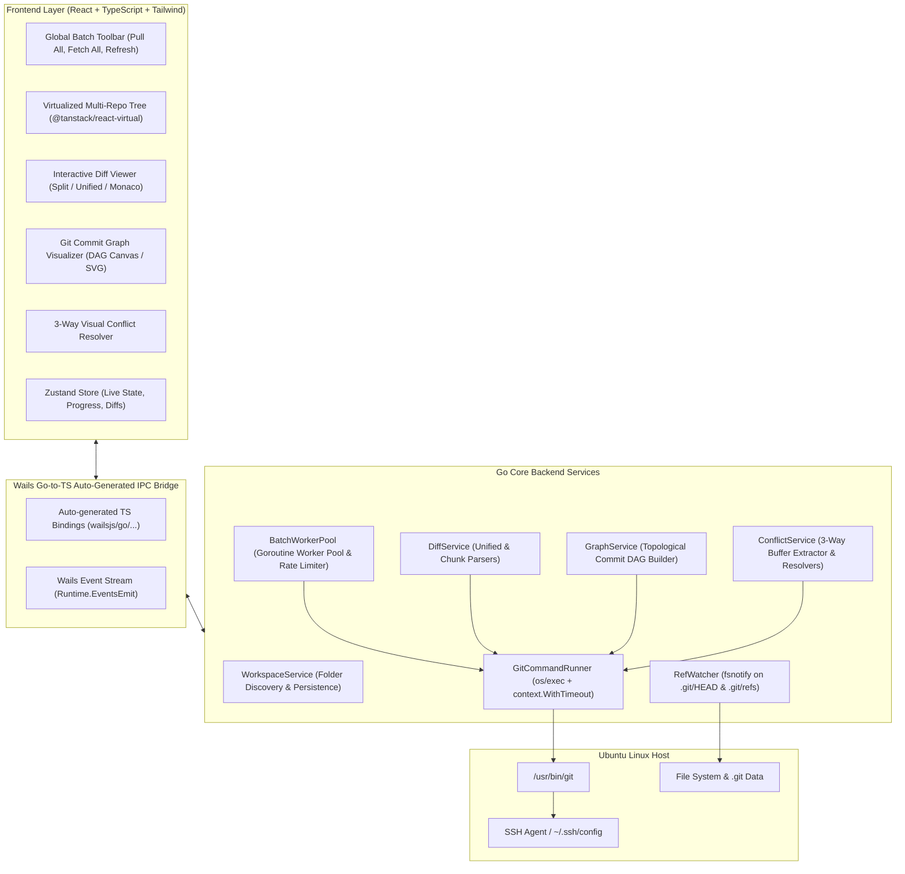

# System Architecture & Implementation Roadmap (Go / Wails Architecture)

This document outlines the software architecture, Go backend services, IPC communication patterns, and phased development roadmap for **OnoGitTree** using **Go (Wails) + React**.

---

## 1. Go + Wails System Architecture



---

## 2. Core Go Backend Services

### 1. `GitCommandRunner` (`backend/git/runner.go`)
- Executes system Git CLI with cancellation context and safe timeout protection:
  ```go
  func (r *GitCommandRunner) Run(ctx context.Context, repoPath string, args ...string) (string, error)
  ```
- Protects against hangings on batch commands by injecting `GIT_TERMINAL_PROMPT=0` and `GIT_SSH_COMMAND=ssh -o BatchMode=yes`.
- Enforces per-repo execution Mutex to prevent `.git/index.lock` collisions.

### 2. `BatchWorkerPool` (`backend/batch/pool.go`)
- Spawns a pool of worker goroutines (default: 5 concurrent workers) communicating via channels:
  ```go
  type BatchJob struct {
      RepoPath string
      Action   string // "pull", "fetch", "push", "status"
  }
  ```
- Emits real-time progress events to the frontend via `runtime.EventsEmit(ctx, "batch:progress", status)`.

### 3. `DiffService` (`backend/git/diff.go`)
- Computes working tree diffs, staged diffs, commit diffs, and branch-to-branch comparisons:
  ```go
  func (s *DiffService) GetFileDiff(repoPath, filePath string, staged bool) (*DiffFile, error)
  ```
- Parses unified diff chunks into structured line objects (`OldLineNum`, `NewLineNum`, `Type: ADD|DEL|UNCHANGED`, `Content`).

### 4. `GraphService` (`backend/git/graph.go`)
- Reads commit logs via `git log --all --topo-order --pretty=format:"%H|%P|%an|%ae|%at|%s|%D"`:
  ```go
  type CommitNode struct {
      Hash      string       `json:"hash"`
      Parents   []string     `json:"parents"`
      Author    string       `json:"author"`
      Date      int64        `json:"date"`
      Subject   string       `json:"subject"`
      Refs      []string     `json:"refs"`
      RailIndex int          `json:"railIndex"` // Visual lane coordinate
  }
  ```
- Calculates topological branch lanes and merge connections in milliseconds.

### 5. `ConflictService` (`backend/git/conflict.go`)
- Detects files with merge/rebase conflicts.
- Extracts `:1:base`, `:2:ours`, `:3:theirs` contents using `git show :<stage>:<filepath>`.
- Provides atomic resolution methods:
  - `ResolveWithOurs(repoPath, filePath)`
  - `ResolveWithTheirs(repoPath, filePath)`
  - `ResolveWithContent(repoPath, filePath, content)`

---

## 3. Implementation Roadmap

### 🚀 Phase 1: MVP - Multi-Repo Discovery & Batch Operations (Target: 1–2 Weeks)
- [x] Tech stack selection & architecture documentation.
- [ ] Initialize Wails v2 project with Go backend + React/Vite/Tailwind frontend.
- [ ] Implement `WorkspaceService` (Add/scan repository folders, JSON persistence).
- [ ] Implement `BatchWorkerPool` (Goroutine worker pool for *Pull All*, *Fetch All*, *Refresh All*).
- [ ] Build multi-repo tree view mirroring GitLens (Repo headers, branch badges, ahead/behind indicators, inline pull/push/fetch).

### 📝 Phase 2: Git Diff & Interactive Branch Controls (Target: 1–2 Weeks)
- [ ] Working tree changed files list with staged/unstaged toggles.
- [ ] Side-by-Side & Unified Diff viewer with syntax highlighting.
- [ ] Branch management (Checkout, Create branch from..., Merge into current, Pull from).
- [ ] Stashes, Tags, and Remotes subtrees.

### 📊 Phase 3: Git Graph & 3-Way Merge Conflict Resolver (Target: 1–2 Weeks)
- [ ] Interactive commit DAG graph visualizer with branch lanes and commit inspection.
- [ ] 3-Way Merge Conflict Resolver (Ours / Base / Theirs / Live resolution buffer).
- [ ] Atomic `git merge --abort` and resolution staging.

### ⚡ Phase 4: Performance Optimization & Linux Packaging (Target: 1 Week)
- [ ] Virtualized tree rendering (`@tanstack/react-virtual`) for 50+ repositories.
- [ ] Real-time `fsnotify` file watching for `.git/refs` with debouncing.
- [ ] Build & package standalone Linux executable (`.deb`, `AppImage`, standalone binary).
