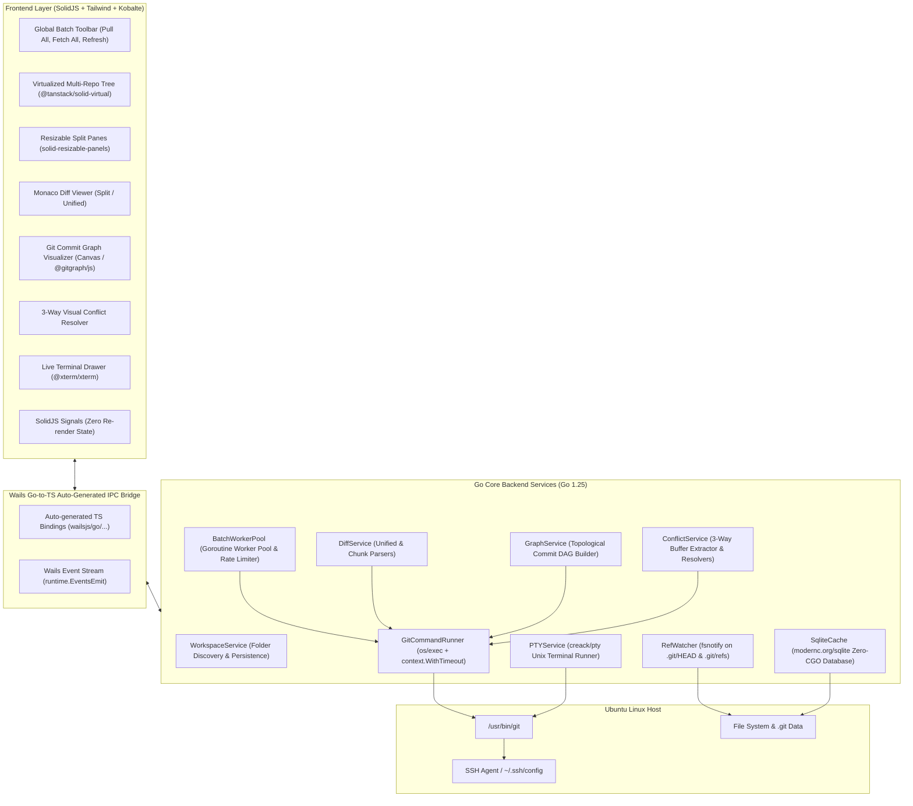

# System Architecture & Implementation Roadmap (Go + SolidJS)

This document outlines the software architecture, Go backend services, IPC communication patterns, and phased development roadmap for **OnoGitTree** using **Go (Wails v2) + SolidJS**.

> [!NOTE]
> **Approved Implementation Stack**: **Go (Wails v2) Backend + SolidJS (TypeScript + Tailwind CSS) Frontend**.

---


## 1. High-Level System Architecture



---

## 2. Core Go Backend Services & IPC Contracts

### 1. `GitCommandRunner` (`backend/git/runner.go`)
- Executes system Git CLI with cancellation context and safe timeout protection:
  ```go
  func (r *GitCommandRunner) Run(ctx context.Context, repoPath string, args ...string) (string, error)
  ```
- Injects `GIT_TERMINAL_PROMPT=0` and `GIT_SSH_COMMAND=ssh -o BatchMode=yes` for non-interactive batch safety.
- Enforces per-repo execution Mutex (`sync.Mutex`) to prevent `.git/index.lock` collisions.

### 2. `BatchWorkerPool` (`backend/batch/pool.go`)
- Spawns a pool of worker goroutines (configurable 5–8 concurrent workers) communicating via channels:
  ```go
  type BatchJob struct {
      RepoID   string `json:"repoId"`
      RepoPath string `json:"repoPath"`
      Action   string `json:"action"` // "pull" | "fetch" | "push" | "status"
  }

  type BatchProgressEvent struct {
      RepoID     string `json:"repoId"`
      RepoPath   string `json:"repoPath"`
      Action     string `json:"action"`
      Status     string `json:"status"` // "pending" | "running" | "success" | "conflict" | "error" | "auth_required"
      Message    string `json:"message"`
      AheadCount int    `json:"aheadCount"`
      BehindCount int   `json:"behindCount"`
  }
  ```
- Emits real-time progress events to the frontend via `runtime.EventsEmit(ctx, "batch:progress", event)`.

### 3. `DiffService` (`backend/git/diff.go`)
- Computes working tree diffs, staged diffs, commit diffs, and branch comparisons:
  ```go
  type DiffFile struct {
      Path         string `json:"path"`
      OldPath      string `json:"oldPath,omitempty"`
      Status       string `json:"status"` // "M" | "A" | "D" | "R" | "U"
      OriginalText string `json:"originalText"`
      ModifiedText string `json:"modifiedText"`
      Language     string `json:"language"`
  }

  func (s *DiffService) GetFileDiff(repoPath, filePath string, staged bool) (*DiffFile, error)
  ```

### 4. `GraphService` (`backend/git/graph.go`)
- Reads commit logs via `git log --all --topo-order --pretty=format:"%H|%P|%an|%ae|%at|%s|%D"`:
  ```go
  type CommitNode struct {
      Hash       string   `json:"hash"`
      Parents    []string `json:"parents"`
      AuthorName string   `json:"authorName"`
      AuthorEmail string  `json:"authorEmail"`
      Timestamp  int64    `json:"timestamp"`
      Subject    string   `json:"subject"`
      Refs       []string `json:"refs"`
      RailIndex  int      `json:"railIndex"`
  }

  func (s *GraphService) GetCommitGraph(repoPath string, limit int) ([]*CommitNode, error)
  ```

### 5. `ConflictService` (`backend/git/conflict.go`)
- Detects conflicted files and extracts 3-way stages:
  ```go
  type ConflictData struct {
      FilePath string `json:"filePath"`
      Base     string `json:"base"`   // Stage :1:
      Ours     string `json:"ours"`   // Stage :2:
      Theirs   string `json:"theirs"` // Stage :3:
  }

  func (s *ConflictService) GetConflictData(repoPath, filePath string) (*ConflictData, error)
  func (s *ConflictService) ResolveConflict(repoPath, filePath, resolvedContent string) error
  func (s *ConflictService) AbortMerge(repoPath string) error
  ```

### 6. TypeScript IPC Interface (Auto-Generated by Wails)

```typescript
// frontend/src/types/git.ts
export interface RepositorySummary {
  id: string;
  name: string;
  path: string;
  currentBranch: string;
  upstreamBranch?: string;
  aheadCount: number;
  behindCount: number;
  lastFetchedAt: string;
  isDirty: boolean;
  changedFilesCount: number;
  hasConflicts: boolean;
  isPinned: boolean;
}

export interface WorkingTreeFile {
  path: string;
  status: 'modified' | 'staged' | 'untracked' | 'deleted' | 'renamed' | 'conflicted';
  staged: boolean;
}

export interface WailsGitService {
  ScanWorkspace(rootPath: string): Promise<RepositorySummary[]>;
  RunBatchAction(action: 'pull' | 'fetch' | 'push' | 'refresh', repoIds: string[]): Promise<void>;
  GetWorkingTree(repoPath: string): Promise<WorkingTreeFile[]>;
  GetFileDiff(repoPath: string, filePath: string, staged: boolean): Promise<DiffFile>;
  GetCommitGraph(repoPath: string, limit: number): Promise<CommitNode[]>;
  GetConflictData(repoPath: string, filePath: string): Promise<ConflictData>;
  ResolveConflict(repoPath: string, filePath: string, content: string): Promise<void>;
  CheckoutBranch(repoPath: string, branch: string): Promise<void>;
  CreateBranch(repoPath: string, branchName: string, startPoint: string): Promise<void>;
  MergeBranch(repoPath: string, sourceBranch: string): Promise<void>;
}
```

---

## 3. Implementation Roadmap

### 🚀 Phase 1: MVP - Multi-Repo Discovery & Batch Operations (Target: 1–2 Weeks)
- [x] Tech stack selection & architecture documentation.
- [ ] Initialize Wails v2 project with Go backend + SolidJS/Vite/Tailwind frontend.
- [ ] Implement `WorkspaceService` & `SqliteCache` (Add/scan repository folders, SQLite persistence).
- [ ] Implement `BatchWorkerPool` (Goroutine worker pool for *Pull All*, *Fetch All*, *Refresh All*).
- [ ] Build multi-repo tree view mirroring GitLens using `@tanstack/solid-virtual` and `lucide-solid`.
- [ ] Integrate `@kobalte/core` for right-click repository and branch context menus.

### 📝 Phase 2: Git Diff & Interactive Branch Controls (Target: 1–2 Weeks)
- [ ] Working tree changed files list with staged/unstaged toggles.
- [ ] Monaco Diff Editor integration (Side-by-Side & Unified modes with syntax highlighting).
- [ ] Branch management (Checkout, Create branch from..., Merge into current, Pull from).
- [ ] Stashes, Tags, and Remotes subtrees.

### 📊 Phase 3: Git Graph & 3-Way Merge Conflict Resolver (Target: 1–2 Weeks)
- [ ] Interactive commit DAG graph visualizer with branch lanes and commit inspection.
- [ ] 3-Way Merge Conflict Resolver (Ours / Base / Theirs / Live resolution buffer).
- [ ] Terminal drawer with `@xterm/xterm` and Go `creack/pty`.

### ⚡ Phase 4: Performance Optimization & Linux Packaging (Target: 1 Week)
- [ ] Real-time `fsnotify` file watching for `.git/refs` with 300ms debouncing.
- [ ] Build & package standalone Linux executable (`.deb`, `AppImage`, standalone binary).

