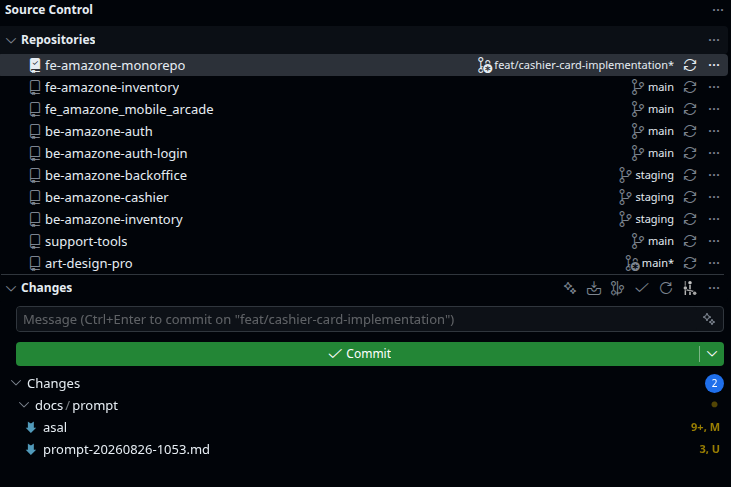

# Comprehensive Pre-Implementation Audit & Verification Matrix

This document provides a thorough audit of the architectural decisions, operational behaviors, edge cases, UX workflows, and open design questions for **OnoGitTree** before code implementation.

---

## 1. Multi-Repository Scope & Workspace Management

### 🔍 Audit Item 1.1: Workspace Presets vs. Single Flat List
* **Question**: How should open repositories be persisted and organized?
* **Options**:
  1. **Named Workspace Presets (Recommended)**: Users can save and switch between named repository groups (e.g., *"Backend Microservices"*, *"Frontend Apps"*, *"Client X"*), with an "All Open" default.
  2. **Single Global Flat List**: The app always reopens the exact list of repositories that were active when last closed.
* **Recommendation**: **Named Workspaces + Recent List**. Stored in embedded SQLite `~/.config/onogitree/onogitree.db`.
* **Answer**: I like the recomendation use that  and I think it can or should be combined with just like vscode no?  and for open repo it should be just like gitkraken, or sourcetree that is it from local or remote something like that.

### 🔍 Audit Item 1.2: Repository Discovery Mechanism
* **Question**: How do repositories get added to OnoGitTree?
* **Options**:
  1. **Dual Mode (Recommended)**:
     - *Add Folder*: Pick a specific folder containing `.git`.
     - *Scan Directory for Repos*: Select a parent folder (e.g., `~/projects/`) and OnoGitTree automatically detects all subdirectories containing `.git` (up to depth 3) with a checklist to select which ones to add.
  2. **Manual Folder Picker Only**: User must pick each repository one-by-one.
* **Recommendation**: **Dual Mode** with multi-folder drag-and-drop support.
* **Answer**: I like the recomendation use that and I think it can or should be combined with just like vscode no?  and for open repo it should be just like gitkraken, or sourcetree that is it from local or remote something like that.

### 🔍 Audit Item 1.3: Cross-Repository Batch Branch Switching
* **Question**: Should users be able to switch branches across multiple repositories simultaneously?
* **Behavior**:
  - If a team names their feature branches consistently (e.g., `feature/payment-v2`), a user can trigger *"Checkout branch in all repos matching 'feature/payment-v2'"*.
  - Repositories that do not have this branch remain on their current branch with a subtle notification.
* **Recommendation**: Enable via the `Ctrl+K` Command Palette.
* **Answer**: do the recommendation, or clicking the branch name to switch the branch like on vscode? if not good or not necessary just ignore it.

---

## 2. Batch Git Operations & Concurrency Policies

### 🔍 Audit Item 2.1: "Pull All" Conflict & Dirty State Policy
* **Question**: What should happen if a repository has uncommitted dirty changes or encounters conflicts during a batch "Pull All"?
* **Scenarios & Proposed Behavior**:
  1. **Clean Repo (Fast-Forward)**: Pulled and fast-forwarded immediately (`✓ Updated`).
  2. **Clean Repo (Merge Commit needed)**: Pulls with merge or rebase based on repository `.gitconfig`.
  3. **Dirty Repo (Uncommitted changes)**:
     - **Option A (Safest - Recommended)**: Skip pulling dirty repository with a badge: `⚠️ Skipped (Working tree dirty)`. User can manually stash or commit.
     - **Option B (Auto-Stash)**: Run `git stash`, pull, and run `git stash pop`. (Risk: Stash pop conflicts in background).
  4. **Conflicted Repo**: Pull pauses on this repo, marks with `⚠️ Merge Conflict`, and opens the 3-Way Conflict Resolver. Other parallel repo pulls continue uninterrupted.
* **Recommendation**: **Option A (Safest)** with a setting toggle for auto-stash.
* **Answer**: I like the recommendation, but we should should have confirmation though so user will have consent to this, they might be just clicking the pull all to see whats going on and if theres any merge conflict they will get notification or something else that indicate "what should we do next" its either we just pauses to the repo that got conflicted or something else, i think thats more convenient.

### 🔍 Audit Item 2.2: "Push All" Safety Guardrails
* **Question**: How to prevent accidental mass pushes across 20+ repositories?
* **Safety Rules**:
  1. "Push All" **never pushes blindly**.
  2. It first opens a **Batch Push Review Modal** listing every repo with unpushed commits (`+ahead > 0`), the branch name, and commit titles.
  3. User can uncheck individual repos or click **"Confirm Push (N repos)"**.
  4. Force pushing (`--force` / `--force-with-lease`) is **strictly forbidden in batch mode** and only allowed on individual repos behind an explicit confirmation dialog.
* **Answer**: Of course it never pushses blindly, it must have confirmation and never add force pushing and if user want to force push they need consent to do this.

### 🔍 Audit Item 2.3: Background Polling Frequency & Battery/CPU Optimization
* **Question**: How often should background auto-fetch/refresh run?
* **Default Configuration**:
  - `inotify` file watcher: Instant reaction (< 50ms) to local Git changes (`.git/HEAD`, `.git/refs/heads/`, `.git/index`).
  - Background Remote Fetch: Configurable interval (Default: **Every 10 minutes**, with options: 5m, 15m, 30m, Manual Only).
  - Pauses automatic network fetches when on battery (optional) or when window is minimized for > 30 minutes.
* **Answer**: I like that default configuration, but this should be also configurable on the application settings or preferences and maybe it can be configurable on each repo has own auto-fetch/refresh, i dunno if that possible or not, and i dunno is that necessary or not, help me decide on this. and if my request are pain on the resource just ignore it and go with your default configuration.

---

## 3. Git Diff Visualizer & Monaco Editor Integration

### 🔍 Audit Item 3.1: Hunk Staging Mechanism
* **Question**: How should hunk-level staging be performed under the hood?
* **Mechanism**:
  - When the user clicks "Stage Hunk" on a diff chunk in Monaco Editor, Go backend generates a patch snippet and pipes it into `git apply --cached --whitespace=nowarn -`.
  - To discard a hunk, Go pipes the inverted patch into `git apply --reverse -`.
  - Ensures zero index corruption.
* **Answer**: I like that but explain me more about this. and do we need confirmation also for this?

### 🔍 Audit Item 3.2: External Editor Deep Linking
* **Question**: Can users jump from a diff file in OnoGitTree to their favorite IDE?
* **Supported Launchers**:
  - VS Code (`code -g <path>:<line>`)
  - Cursor (`cursor -g <path>:<line>`)
  - Neovim / Vim (`nvim +<line> <path>` in terminal)
  - Zed (`zed <path>:<line>`)
  - Host File Manager (`xdg-open <dir>`)
* **Answer**: yes they can and we should add that

---

## 4. Git Graph (Commit DAG) Scope & Rendering

### 🔍 Audit Item 4.1: Single Active Repo vs. Interleaved Multi-Repo Graph
* **Question**: Should the Git Graph show one repository at a time or interleave commits from all 20 repos?
* **Analysis**:
  - Interleaving 20 distinct Git repositories into a single DAG creates an unreadable, non-causal timeline with disconnected rail colors.
  - Standard industry practice (GitLens, GitKraken, SourceTree): The Git Graph visualizes the **currently selected / active repository** in full topological detail.
  - A quick-switch header dropdown/tabs lets the user jump between repo graphs instantly.
* **Recommendation**: **Active Repository Graph** with multi-repo search and instant switching.
* **Answer**: Git Graph should show one repository at a time and you recommendation already said that, go with that recommendation.

### 🔍 Audit Item 4.2: Commit Pagination & Memory Footprint
* **Question**: How to handle repositories with 100,000+ commits (e.g. Linux kernel or giant monorepos)?
* **Strategy**:
  - Load the most recent **500 commits** on initial render.
  - Infinite scroll / virtualized Canvas buffer automatically fetches next 500 commits when scrolling near the bottom.
  - Keeps idle RAM under **50 MB** regardless of total Git repository history size.
* **Answer**: Yap correct strategy i like that. and i think we should have resource monitor for this? to see RAM, CPU or even DISK USAGE on the app? is that necessary? is that worth it? is that needed? if is not possible, then ignore it.

---

## 5. 3-Way Merge Conflict Resolver

### 🔍 Audit Item 5.1: Conflict Data Source
* **Question**: How are conflicting file versions retrieved?
* **Git Index Plumbing**:
  - Stage 1 (`git show :1:<path>`): Common Base Ancestor
  - Stage 2 (`git show :2:<path>`): Ours (Current HEAD / Branch)
  - Stage 3 (`git show :3:<path>`): Theirs (Incoming Branch / Remote)
* **Resolver Layout**:
  - Top Row: 3 read-only preview panes with syntax highlighting (*Ours* vs *Base* vs *Theirs*).
  - Bottom Row: 1 live editable resolution pane with action buttons (*Accept Ours*, *Accept Theirs*, *Accept Both*, *Mark Resolved*).
  - Once marked resolved, runs `git add <path>`.
* **Answer**: i like your resolver layout, but i needed more explanation.

---

## 6. Authentication & Credentials on Linux (Ubuntu)

### 🔍 Audit Item 6.1: SSH Keys & Passphrases
* **Non-Interactive Batch Mode**:
  - Sets `GIT_SSH_COMMAND="ssh -o BatchMode=yes"` and `GIT_TERMINAL_PROMPT=0` during batch operations.
  - If a key requires an unlocked SSH Agent and none is available, the repo is flagged `🔑 Auth Required` without hanging other repos.
* **Interactive Single-Repo Auth**:
  - When the user manually triggers a fetch/pull on an auth-flagged repo, OnoGitTree forwards the SSH passphrase or token prompt cleanly.
* **Answer**: We should follow how gitlens, gitkraken, sourcetree or any tools that doing this? maybe check if glab cli installed? gh auth cli installed? or what? do web search about this.

---

## 7. Verification & Readiness Checklist

| Category | Item | Status | Action Required |
| :--- | :--- | :---: | :--- |
| **Toolchain** | Go 1.25 installed | ✅ Ready | `go version go1.25.14` |
| **Toolchain** | Node.js v24 installed | ✅ Ready | `v24.18.1` |
| **Toolchain** | Git CLI installed | ✅ Ready | `git version 2.53.0` |
| **OS Libraries** | WebKit2GTK 4.1 runtime | ✅ Ready | `libwebkit2gtk-4.1-0` present on Ubuntu |
| **OS Libraries** | GTK-3 runtime | ✅ Ready | `libgtk-3-0t64` present on Ubuntu |
| **Architecture** | Go Wails v2 + SolidJS | ✅ Approved | Ratified in docs & root README |
| **Data Layer** | SQLite persistence | ✅ Approved | Pure Go `modernc.org/sqlite` |
| **Concurrency** | Worker pool throttling | ✅ Approved | Max 5–8 concurrent goroutines |
| **UI Components**| Kobalte + Monaco + Canvas | ✅ Approved | Zero-VDOM fine-grained updates |
