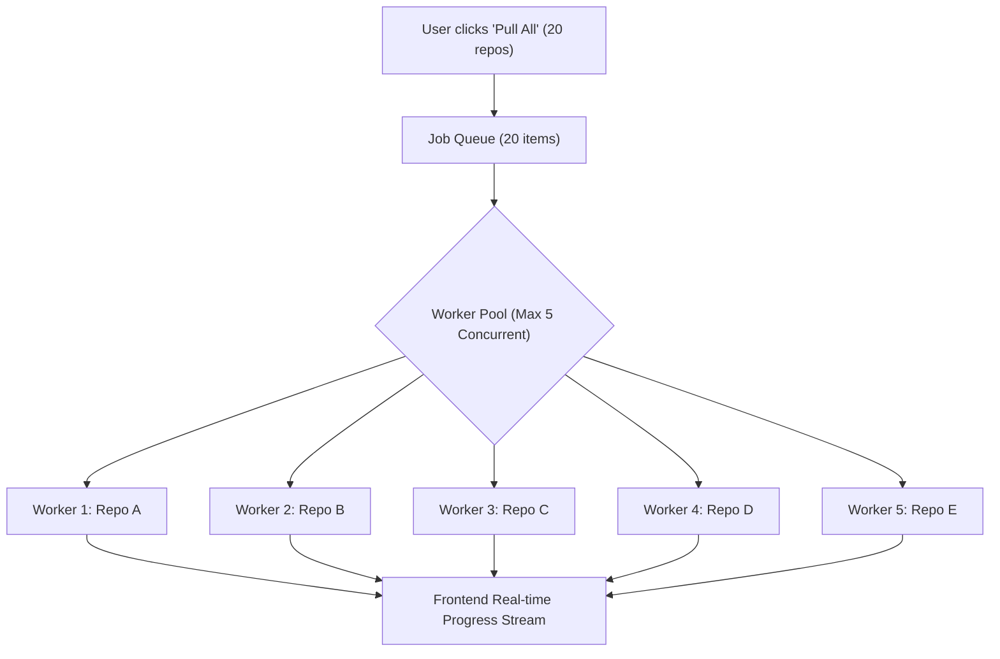

# Technical Challenges & Architectural Considerations

Building a robust multi-repository Git client involves several non-trivial distributed systems and OS-level challenges. This document details each challenge and the architectural solutions required for **OnoGitTree**.

---

## 1. Concurrency Management & Process Throttling

### The Challenge:
When a user has 20+ repositories open and clicks **"Pull All"** or **"Fetch All"**, launching 20 concurrent child processes can:
- Exhaust system file descriptors and socket limits.
- Cause CPU and memory spikes on Linux.
- Trigger rate-limiting or connection resets from remote hosts (GitHub, GitLab, self-hosted servers).
- Freeze the UI if standard I/O is not streamed asynchronously.

### Solution:
- **Worker Pool with Concurrency Limiter (e.g. `p-limit` / Task Queue)**:
  - Cap concurrent network operations to **4–6 parallel workers**.
  - Queue remaining repository jobs in FIFO order.
  - Stream progress to the frontend per repository (e.g. `[Pending] -> [Fetching] -> [Done | Conflict | Error]`).

---

## 2. Git Locking (`index.lock`) & Race Conditions

### The Challenge:
Git creates `.git/index.lock` during any state-modifying operation.
If a background auto-refresh runs `git status` or `git fetch` at the exact same millisecond the user triggers `git checkout` or `git pull`, Git aborts with:
`fatal: Unable to create '.git/index.lock': File exists.`

### Solution:
- **Per-Repository Async Mutex**:
  - Every repository in the backend has its own serialized command queue (Mutex).
  - Mutating operations (`pull`, `merge`, `checkout`, `commit`, `stash`) wait for active operations on that specific repo to finish before executing.
- **Read-Only Non-Locking Flags**:
  - Use `git --no-optional-locks status --porcelain=v2` for background status checks to prevent Git from taking optional index locks or modifying `.git/index` stat cache.

---

## 3. SSH & HTTPS Authentication Handling in Batch Mode

### The Challenge:
During a batch "Pull All" or "Fetch All", if a remote repository requires an SSH passphrase or HTTPS token:
- If Git prompts on `stdin`, spawned processes will hang indefinitely waiting for input.
- If SSH agent isn't configured, multiple terminal prompt windows could pop up simultaneously, freezing the system.

### Solution:
- **Environment Flags for Batch Operations**:
  - Set `GIT_TERMINAL_PROMPT=0` and `GIT_SSH_COMMAND="ssh -o BatchMode=yes"` for background batch fetches.
  - If a repo returns `Permission denied (publickey)` or `Authentication failed`, mark that repo with an **Auth Required ⚠️** badge rather than hanging the entire queue.
- **Interactive Single-Repo Credential Prompts**:
  - When the user manually clicks "Pull" or "Push" on an unauthenticated repository, launch an interactive credential dialog or forward the SSH passphrase request cleanly.

---

## 4. Linux File System Watching (`inotify` Limits & CPU Load)

### The Challenge:
On Linux (Ubuntu), file watchers consume `inotify` watches. If you watch full repository working directories (which contain millions of files inside `node_modules`, `venv`, `target`, `dist`, `.cache`), the system will:
1. Hit `/proc/sys/fs/inotify/max_user_watches` error.
2. Max out CPU consumption during `npm install` or builds.

### Solution:
- **Watch Only `.git` State Files**:
  - Do **not** watch the entire working tree with recursive watchers.
  - Only watch:
    - `.git/HEAD` (detects branch switches)
    - `.git/refs/heads/**` (detects new local commits)
    - `.git/refs/remotes/**` (detects fetched remote refs)
    - `.git/index` (detects staging/working tree changes)
- **Debounced Polling for Working Tree**:
  - Debounce file change events by **300ms – 500ms** to collapse rapid file bursts into a single refresh.
  - Refresh working tree dirty status on application window focus (`window.addEventListener('focus', ...)`).

---

## 5. Batch Conflict & Error Isolation

### The Challenge:
If a user runs "Pull All" on 10 repositories and repository #4 has a merge conflict, stopping the entire operation ruins the multi-repo productivity experience.

### Solution:
- **Graceful Error Isolation**:
  - Each repository job runs in a `try...catch` boundary.
  - Succeeded repositories are marked `✓ Updated`.
  - Conflicted repositories are marked `⚠️ Merge Conflict` with options:
    - *Open in Conflict Resolver*
    - *Abort Merge (`git merge --abort`)*
    - *Open in Terminal*
  - Fast-forwardable or up-to-date repositories finish cleanly without interrupting others.

---

## 6. Tree Virtualization & DOM Rendering Performance

### The Challenge:
With 20+ open repositories, expanding branches, tags, stashes, and commit histories can quickly generate **3,000+ DOM nodes**, causing scroll lag and high memory consumption in webviews.

### Solution:
- **Virtualized Tree / List Rendering (`@tanstack/react-virtual`)**:
  - Flattens the hierarchical tree into a computed visible items array.
  - Only the 25–40 items currently visible on the screen are rendered in the DOM.
  - Provides instant 60 FPS scrolling and low memory consumption regardless of tree size.
