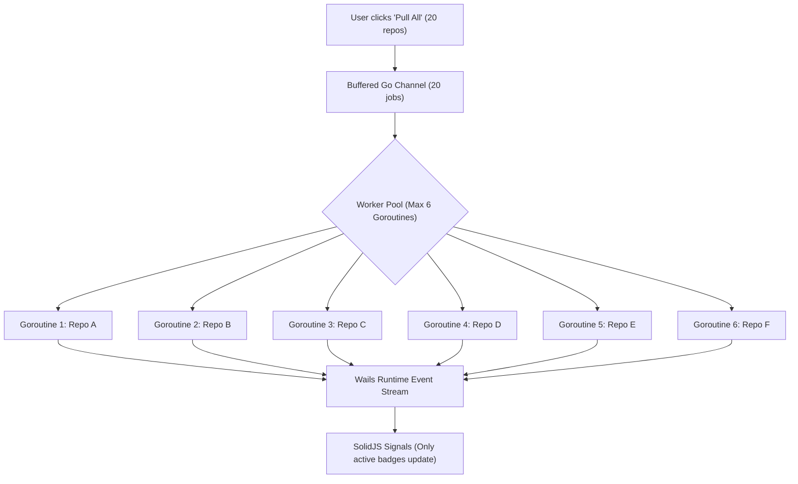

# Technical Challenges & Architectural Considerations

Building a multi-repository Git client involves several critical concurrency, operating system, memory management, and data consistency challenges. This document explains each concern in detail along with the architectural solutions and mitigations in **OnoGitTree**.

---

## 1. Concurrency Management & Process Throttling

### The Concern:
When a user has 20+ repositories open and triggers **"Pull All"** or **"Fetch All"**, spawning 20 concurrent OS child processes simultaneously can:
- Exhaust system file descriptors, process tables, and socket limits.
- Cause CPU and RAM spikes on Linux.
- Trigger network rate-limiting or connection drops from remote Git servers (GitHub, GitLab, self-hosted).
- Freeze the desktop UI if I/O is not streamed asynchronously.

### Solution & Mitigation:
- **Go Goroutine Worker Pool with Semaphore Channels**:
  - Limit concurrent network operations to **5–8 parallel workers** (configurable in user settings).
  - Queue remaining repository jobs in a buffered Go channel.
  - Stream real-time progress events per repository (`[Pending] ➔ [Pulling] ➔ [Done | Conflict | Error]`) to the SolidJS frontend.

---

## 2. Git Locking (`index.lock`) & Race Conditions

### The Concern:
Git creates `.git/index.lock` during any state-modifying operation.
If a background auto-refresh runs `git status` or `git fetch` at the exact same millisecond the user triggers `git checkout` or `git pull`, Git aborts with:
`fatal: Unable to create '.git/index.lock': File exists.`

### Solution & Mitigation:
- **Per-Repository Mutex in Go**:
  - Every repository instance in Go maintains a `sync.Mutex`.
  - Mutating operations (`pull`, `merge`, `checkout`, `commit`, `stash`) lock the repository mutex, ensuring only one write command executes on that repository at a time.
- **Read-Only Non-Locking Flags**:
  - Use `git --no-optional-locks status --porcelain=v2` for background polling. This tells Git not to take optional index locks or modify the `.git/index` stat cache.

---

## 3. SSH & HTTPS Authentication Handling in Batch Mode

### The Concern:
During a batch "Pull All" or "Fetch All", if a remote repository requires an SSH passphrase or HTTPS token:
- If Git prompts on `stdin`, spawned processes will hang indefinitely waiting for input.
- If SSH agent isn't running, multiple terminal prompt windows could pop up simultaneously, freezing the system.

### Solution & Mitigation:
- **Non-Interactive Batch Environment Flags**:
  - Set `GIT_TERMINAL_PROMPT=0` and `GIT_SSH_COMMAND="ssh -o BatchMode=yes"` for background batch fetches.
  - If a repo returns `Permission denied (publickey)` or `Authentication failed`, mark that repo with an **Auth Required ⚠️** badge rather than hanging the entire queue.
- **Interactive Single-Repo Auth**:
  - When the user manually clicks "Pull" or "Push" on an unauthenticated repository, launch an interactive credential dialog or forward the SSH passphrase request cleanly.

---

## 4. Linux File System Watching (`inotify` Limits & CPU Load)

### The Concern:
On Linux (Ubuntu), file watchers consume `inotify` watches. If you recursively watch full repository working directories (which contain millions of files inside `node_modules`, `venv`, `target`, `dist`, `.cache`), the system will:
1. Hit `/proc/sys/fs/inotify/max_user_watches` error.
2. Max out CPU consumption during `npm install` or builds.

### Solution & Mitigation:
- **Watch Only `.git` State Files via `fsnotify`**:
  - Do **not** watch the entire working tree with recursive watchers.
  - Only watch:
    - `.git/HEAD` (detects branch switches)
    - `.git/refs/heads/**` (detects new local commits)
    - `.git/refs/remotes/**` (detects fetched remote refs)
    - `.git/index` (detects staging/working tree changes)
- **Debounced Polling for Working Tree**:
  - Debounce file change events by **300ms – 500ms** to collapse rapid file bursts into a single refresh.
  - Refresh working tree dirty status on application window focus.

---

## 5. Batch Conflict & Error Isolation

### The Concern:
If a user runs "Pull All" on 10 repositories and repository #4 has a merge conflict, stopping the entire operation ruins the multi-repo productivity experience.

### Solution & Mitigation:
- **Graceful Error Isolation**:
  - Each repository job runs in an isolated Goroutine recovery boundary.
  - Succeeded repositories are marked `✓ Updated`.
  - Conflicted repositories are marked `⚠️ Merge Conflict` with one-click options:
    - *Open 3-Way Conflict Resolver*
    - *Abort Merge (`git merge --abort`)*
    - *Open in Terminal Drawer*
  - Fast-forwardable or up-to-date repositories finish cleanly without interrupting others.

---

## 6. Tree Virtualization & DOM Rendering Performance

### The Concern:
With 20+ open repositories, expanding branches, tags, stashes, and commit histories can quickly generate **5,000+ DOM nodes**, causing scroll lag and memory bloat.

### Solution & Mitigation:
- **Virtualized Tree Rendering (`@tanstack/solid-virtual`)**:
  - Flattens the hierarchical tree into a computed visible items array.
  - Only the 25–40 items currently visible in the viewport are rendered into the real DOM.
  - SolidJS signals ensure that updating a single badge does not trigger re-rendering of surrounding items.

---

## 7. Large Git Diffs & WebKit Memory Management

### The Concern:
Opening large diffs (e.g. 5,000-line lockfiles or generated bundles) in Monaco Editor can lead to high RAM consumption if editor models are not disposed of properly.

### Solution & Mitigation:
- **Explicit Monaco Model Disposal**:
  - Whenever switching between diff files, call `oldModel.dispose()` to prevent V8 heap leaks in WebKitGTK.
- **Diff Chunk Size Guardrails**:
  - Files exceeding 2 MB or 10,000 lines show a *"Large diff detected (Click to load anyway)"* banner to protect memory.

---

## 8. Commit Graph Topological Layout Performance

### The Concern:
Repositories with 50,000+ commits (e.g. large monorepos) will freeze the browser thread if rendered as SVG DOM elements.

### Solution & Mitigation:
- **HTML5 Canvas + Viewport Culling**:
  - The commit rail DAG is painted on an HTML5 Canvas using an offscreen buffer.
  - Only commits within the vertical scroll window `[scrollTop, scrollTop + viewportHeight]` have their Bézier curves and nodes rasterized.
  - An SVG/HTML overlay provides crisp text, badges, and clickable interaction targets for visible commits only.

